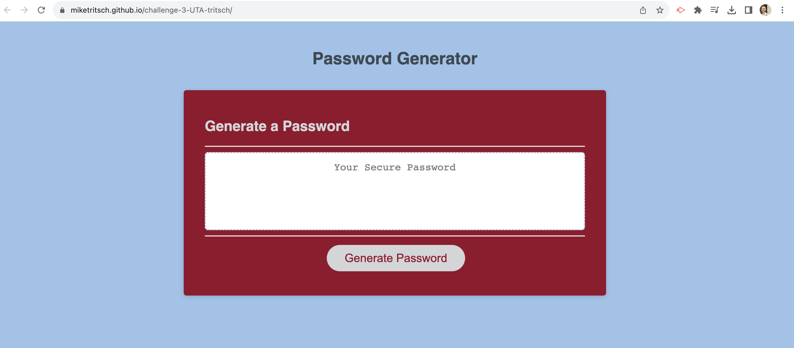
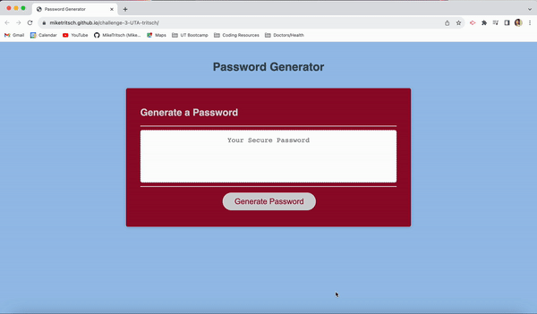

# Password Generator

A random password generator, customizable to your every day needs!

## Description

Ah, my first ever piece of JavaScript coding. I'm sure I'll look back on this, someday and remember how proud of myself I was to have completed this challenge!
Welcome to my Colorado Rapids themed Random Password Generator. For challenge 3, I was tasked with creating a random password generator using JavaScript. I was given some starter code, which included a styled HTML file and CSS file, along with some starter code in the JS file. I was reponsible for writing the code to generate the password. 

The challenge called for user interactivity in order to determine what kind of password to generate, based on the user's input. I built this project in order to create safe and secure passwords for myself, rather than recyling through the same three phrases I usually used. I learned how variables are stored and created as well as their functionality across JS. I learned how different items in a JacaScript file interact with one another on a small and broad scale.

## What comes next? and other issues...

I'm sure there are a few aspects of this page that a QA team would send back to me. For example, if I enter 10 as my desired length of password, the code seems to log 10 arrays, each containing the password. I look forward to specifying my code to resolve and clean up issues like this as I progress through JS.

## Installation

N/A

## Usage

Upon launching the application, you'll be met with the screenshot below:

From there, click the "Generate Password" button.

A window message will pop up prompting you to enter your desired password length (Note: Must be between 8 and 128, otherwise, the generator will reset)

A series of confirm prompts will then pop up as you answer password specific questions (Note: Clicking "Cancel" is equal to answering "No")

After entering your criteria, your new password will generate within the text box in the middle of the page!

## Credits

Colorado Rapids Color Palette: https://teamcolorcodes.com/colorado-rapids-team-color-codes/

Random Array Item Selection: https://css-tricks.com/snippets/javascript/select-random-item-array/

## License

MIT License

Copyright (c) 2023 Mike Tritsch

Permission is hereby granted, free of charge, to any person obtaining a copy
of this software and associated documentation files (the "Software"), to deal
in the Software without restriction, including without limitation the rights
to use, copy, modify, merge, publish, distribute, sublicense, and/or sell
copies of the Software, and to permit persons to whom the Software is
furnished to do so, subject to the following conditions:

The above copyright notice and this permission notice shall be included in all
copies or substantial portions of the Software.

THE SOFTWARE IS PROVIDED "AS IS", WITHOUT WARRANTY OF ANY KIND, EXPRESS OR
IMPLIED, INCLUDING BUT NOT LIMITED TO THE WARRANTIES OF MERCHANTABILITY,
FITNESS FOR A PARTICULAR PURPOSE AND NONINFRINGEMENT. IN NO EVENT SHALL THE
AUTHORS OR COPYRIGHT HOLDERS BE LIABLE FOR ANY CLAIM, DAMAGES OR OTHER
LIABILITY, WHETHER IN AN ACTION OF CONTRACT, TORT OR OTHERWISE, ARISING FROM,
OUT OF OR IN CONNECTION WITH THE SOFTWARE OR THE USE OR OTHER DEALINGS IN THE
SOFTWARE.

